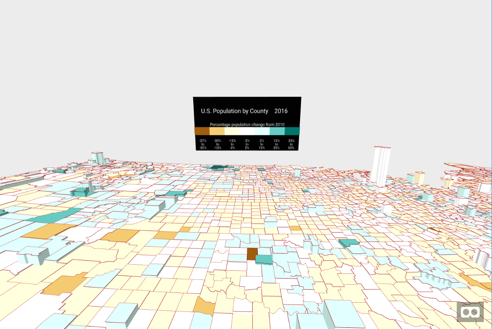

# Visualization of U.S. Population in VR

A visualization of the United States population by county using WebVR.  The height of each county represents the number of people.
The colors show the estimated percentage change in population since July 1, 2010.

If you have an HTC Vive or Occulus Rift, you can use the controllers to move and scale the visualization using the [super hands component](https://github.com/wmurphyrd/aframe-super-hands-component).

## About the Data

The visualization uses data from [census.gov](https://census.gov) for both the map and the population estimates.
The `data` subdirectory contains the source data files used in the visualization.

The script `data/build-data-files.sh`
provides a reproducable way to download and process the data files into the versions in `src/assets` that are used
directly in the visualization.  Note that build-data-files.sh must be run from within the `data` subdirectory.  It also
requires several globally installed npm packages.  See the header of the file for details.

If you want to re-download the data files, you'll need a [census.gov API key](https://api.census.gov/data/key_signup.html).
Make a copy of .env.example, name it .env, and put your API key there.

Finally, per the instructions on census.gov, I must state that "This product uses the Census Bureau Data API but is not endorsed or certified by the Census Bureau."

### Local Development

First make sure you have Node installed.

On Mac OS X, it's recommended to use [Homebrew](http://brew.sh/) to install Node + [npm](https://www.npmjs.com):

    brew install node

To install the Node dependencies:

    npm install

To serve the site from a simple Node development server:

    npm start

Then launch the site from your favorite browser:

[__http://localhost:3000/__](http://localhost:3000/)

To deploy changes to github pages, run:

    npm run deploy

To be able to view the dev server on another device, use [ngrok](https://ngrok.com/) with the host-header set:

ngrok http 3000 --host-header="localhost:3000"

## License

This program is free software and is distributed under an [MIT License](LICENSE).
